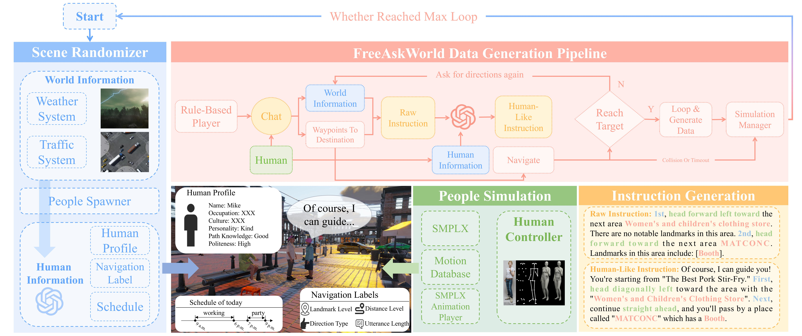
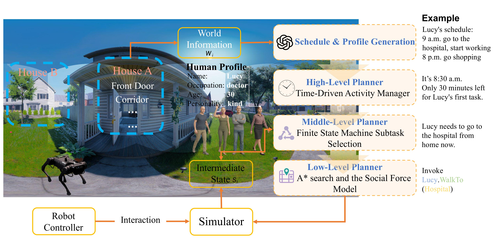
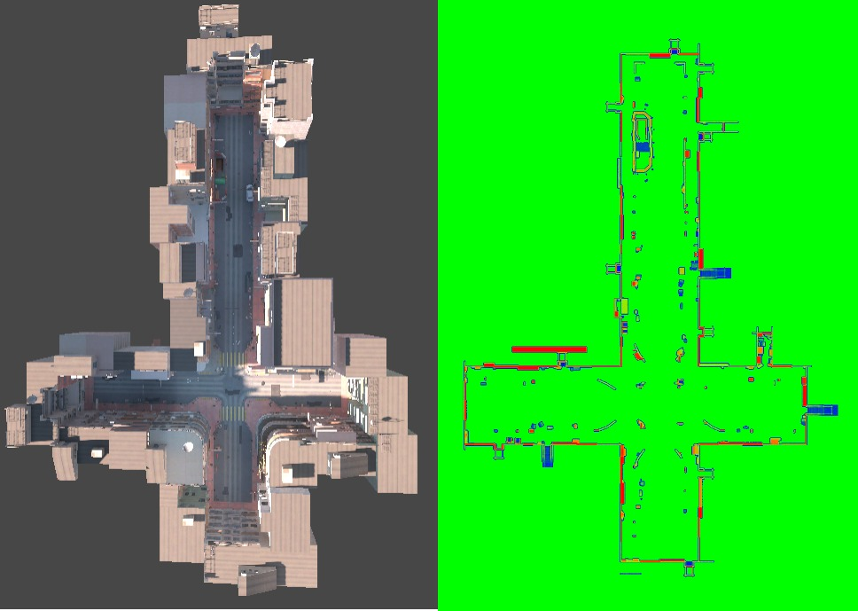
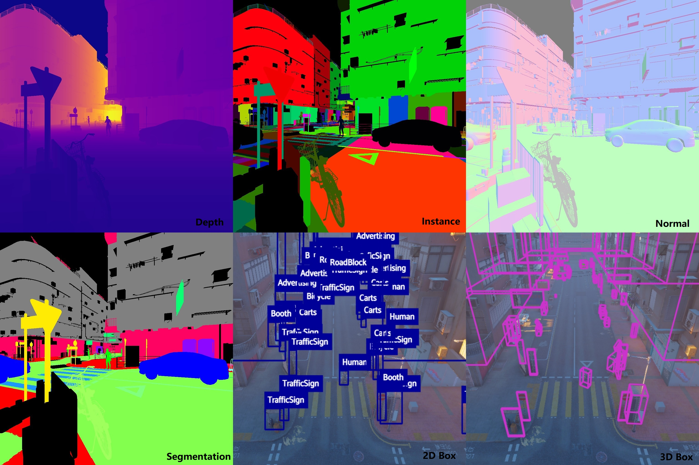

<p align="center">
  
</p>

<p align="center">
  <h1 align="center">FreeAskWorld Simulator (AAAI26 Oral)</h1>
</p>

<p align="center">
  <strong>An Interactive and Closed-Loop Simulator for Human-Centric Embodied AI</strong>
</p>

<p align="center">
  <!-- Badges -->
  <!-- <a href="$$LINK_TO_YOUR_PAPER_PDF$$" target="_blank">
    
  </a> -->

  <a href="https://arxiv.org/abs/2511.13524" target="_blank">
    
  </a>

  <a href="https://huggingface.co/datasets/Astronaut-PENG/FreeAskWorld" target="_blank">
    
  </a>

  <!-- <a href="$$LINK_TO_YOUR_DATASET_PAGE$$" target="_blank">
    
  </a> -->

  <a href="LICENSE" target="_blank">
    
  </a>

  <!-- Baseline Closed-Loop Repo -->
  <a href="https://github.com/doraemonaaaa/FreeAskWorldConnector" target="_blank">
    
  </a>

  <a href="https://github.com/AIR-DISCOVER/FreeAD" target="_blank">
    
  </a>

  <a href="https://github.com/doraemonaaaa/FreeAskAgent" target="_blank">
    
  </a>


</p>

<p align="center">
  FreeAskWorld is an interactive simulation framework that integrates large language models (LLMs) for high-level planning and socially grounded interaction in embodied AI.
</p>

<p align="center">
  
</p>
<p align="center">
  
</p>
<p align="center">
  
</p>

---

# Project Milestones

- [x] 📝 **Paper Publication**: Published the main research paper describing FreeAskWorld.
- [x] 📊 **Data Processing Code Release**: Released code for preprocessing, data cleaning, and annotation pipelines.
- [x] 🎥 **Presentation Video**: Released project presentation video.
- [ ] 🛠️ **Simulator Code Release**: Publish the core simulation code for developers and external collaborators.
- [x] 🤖 **Agent Robot Integration**: Integrate agent interfaces (OpenClaw / Codex / Claude / custom) to access and interact with robots inside the FreeAskWorld simulation environment.
- [ ] 📚 **Usage Tutorial**: Create a comprehensive tutorial for using the FreeAskWorld simulator, including setup, configuration, and example workflows.
- [ ] 🧑‍💻 **API Documentation**: Provide thorough documentation of the simulator’s API for seamless integration and extension.
- [ ] 🎮 **Steam Release**: Prepare and publish the FreeAskWorld simulator on Steam for broader accessibility.

Agent integration note: the current recommended local path is ROS2-first, because the local Unity simulator is configured in ROS2 mode on `127.0.0.1:10000`. See [docs/agent_ros2_integration.md](docs/agent_ros2_integration.md). The ROS2 path now includes a live-capable `rclpy` transport when external ROS2 runtime dependencies are present, while still preserving scaffold-only fallback behavior. For live ROS2 usage, a repo-local `.ros2_venv` or equivalent ROS-compatible Python environment may be needed to avoid ROS Humble `rclpy` ABI mismatch, and the wrapper at `scripts/agent_ros2_cli.sh` now auto-activates `.ros2_venv` when present. The additive `closed_loop` websocket Agent bridge remains available, but for this Unity setup it should be treated as experimental and future-facing rather than the primary runtime path.

Agent config entry paths (for OpenClaw / Claude Code / Codex / custom agent adapters):
- ROS2 integration doc: `docs/agent_ros2_integration.md`
- ROS2 package: `integrations/agent_ros2/`
- ROS2 wrapper CLI: `scripts/agent_ros2_cli.sh`
- Closed-loop bridge API/CLI: `closed_loop/agent_bridge.py`, `closed_loop/agent_server.py`, `closed_loop/agent_cli.py`, `closed_loop/agent_mcp.py`

**Help auto install Agent ROS2 Integration.** Other AI agents can discover these paths and install/configure automatically.

Canonical entry command for auto-discovery:
- `bash scripts/agent_ros2_cli.sh --help`

## First-time setup notes (read this before install)

For external users, the current repo is **partially runnable** out of the box, but the full Unity + ROS2 live path depends on external runtime setup and machine permissions.

Common first-time blockers:
- **Python dependencies require network access.** `pip install -r requirements.txt` may fail in restricted environments, behind an unavailable proxy, or without a reachable package index.
- **The main local runtime path is ROS2-first.** The recommended entry is the ROS2 scaffold in `integrations/agent_ros2/`, not the older websocket bridge in `closed_loop/`.
- **Live ROS2 mode needs external runtime support.** `--ros2-live` requires a valid ROS2 environment, ROS2/DDS permissions, and access to the Unity-side ROS2 backend (current local config: `127.0.0.1:10000`).
- **The websocket `closed_loop` path is additive, not the primary local path** for the current Unity configuration.

Recommended minimal verification sequence after cloning:

```bash
python3 -m venv .venv
source .venv/bin/activate
pip install -r requirements.txt

# Minimal repo-level smoke checks
python -m integrations.agent_ros2.cli --help
python -m integrations.agent_ros2.cli status --output-json
python -m integrations.agent_ros2.cli observe --output-json

# Recommended wrapper for ROS2 live mode
bash scripts/agent_ros2_cli.sh --help
```

Expected behavior for the minimal checks above:
- `--help` should print CLI usage.
- `status --output-json` should run even without Unity connected.
- In scaffold-only mode, `transport_ready` may be `false`; this does **not** by itself mean the repo is broken.
- Full live control requires the external Unity + ROS2 runtime path to be available.

If `--ros2-live` fails immediately on a fresh machine, check these first:
- ROS2 environment is installed and sourced correctly.
- The Unity/ROS2 backend is actually running and reachable.
- The machine allows DDS/UDP/shared-memory transport required by ROS2 middleware.
- The ROS log directory is writable (for example, set `ROS_LOG_DIR=/tmp/roslog` if needed).

---

## 🎥 Demos
**Simulator Presentation**
Demonstrates the main functions of this simulator.

<p align="center">
  <!-- 直接展示视频 + 保留下载链接 -->
  <video width="800" controls>
    <source src="docs/Presentation.mp4" type="video/mp4">
    你的浏览器不支持 HTML5 视频播放，请点击下方链接下载。
  </video>
  <br>
  <a href="docs/Presentation.mp4">📥 Download Simulator Presentation Video</a>
</p>

**Simulator APP Presentation**
Demonstrates the main functions of this simulator.

<p align="center">
  <!-- 直接展示视频 + 保留下载链接 -->
  <video width="800" controls>
    <source src="docs/APP Presentation.mp4" type="video/mp4">
    你的浏览器不支持 HTML5 视频播放，请点击下方链接下载。
  </video>
  <br>
  <a href="docs/APP Presentation.mp4">📥 Download APP Presentation Video</a>
</p>

**ROS2 Example**
Demonstrates the ROS2 RGBD SLAM in our simulator.
<p align="center">
  <!-- 直接展示视频 + 保留下载链接 -->
  <video width="800" controls>
    <source src="docs/RGBD SLAM Presentation.mp4" type="video/mp4">
    你的浏览器不支持 HTML5 视频播放，请点击下方链接下载。
  </video>
  <br>
  <a href="docs/RGBD SLAM Presentation.mp4">📥 Download ROS2 Example Video</a>
</p>


## 📌 Introduction

As embodied intelligence progresses, simulation platforms must evolve beyond low-level physics toward **human-centric, socially interactive environments**.  
**FreeAskWorld** introduces:

- A **closed-loop interactive simulator**
- A **scalable human-agent world modeling framework**
- A **modular data generation pipeline**
- A new benchmark: **Direction Inquiry Task**, extending VLN to **active question-asking & guidance following**

This repo contains **simulator code** and **baseline models** from our AAAI 2026 paper.

---

## ✨ Key Features

| Feature | Description |
|---|---|
| 🤖 **LLM-Powered Agents** | Intention modeling, reasoning, natural dialog, instruction generation |
| 🚶 **Realistic Humans** | Personalized profiles, schedules, motion & navigation styles |
| 🌦️ **Dynamic World** | Weather, lighting, traffic, and scene randomization |
| 🔁 **Closed-Loop Sync** | WebSocket-based state exchange for real-time model interaction |
| 🧩 **Direction Inquiry Task** | Agents ask for help, interpret human guidance, adapt plans |
| 📦 **Large-Scale Data** | 6 tasks · 16 object categories · 63,429 frames · 17+ hours |
| 🔄 **Data Generation Pipeline** | Modular pipeline for generating embodied ai data |

---

## Synthetic Data Generation
docs/OccupancyMapGenerationContrast.jpg
docs/SyhteticDataPic.jpg

We used Unity Perception (Borkman et al. 2021) to build a rich and diverse synthetic dataset that includes multiple annotation types and data modalities. The dataset is designed to support a wide range of vision, navigation, and human–computer interaction tasks, and contains both dense per-frame annotations and global scene-level metadata. The main components are:

- **Visual annotations:** 2D/3D bounding boxes, instance segmentation, and semantic segmentation.  
- **Geometric annotations:** depth maps and surface normal maps for scene geometry.  
- **Visual observations:** panoramic RGB images and six 90° perspective views.  
- **Interaction data:** natural language instructions, dialog histories, and agent trajectories.  
- **Spatial representations:** 2D occupancy heatmaps for mapping and localization.  
- **Environment metadata:** map boundaries, semantic regions, and other contextual information.

The dataset covers 16 common object categories (e.g., vehicles, pedestrians, street furniture). By combining 2D occupancy heatmaps (encoding static layout) with 3D bounding boxes (capturing dynamic entity positions) and the provided world coordinates, we can accurately reconstruct simulated scenes to create a comprehensive digital twin. This reconstructed environment supports open-loop evaluations similar to nuScenes (Caesar et al. 2020), and is particularly suited for unstructured environments as in FreeAD (Peng et al. 2025). The dataset enables a broad spectrum of downstream tasks including navigation planning, behavior prediction, and human–computer interaction studies.

The figures below illustrate occupancy map generation and sample synthetic data:






## 🚀 Getting Started

### Quick Start (recommended for first-time users)

```bash
git clone https://github.com/AIR-DISCOVER/FreeAskWorld
cd FreeAskWorld

python3 -m venv .venv
source .venv/bin/activate
pip install -r requirements.txt

# Minimal smoke check
python -m integrations.agent_ros2.cli --help
python -m integrations.agent_ros2.cli status --output-json

# Recommended wrapper for ROS2 live mode
bash scripts/agent_ros2_cli.sh --help
```

If you only want to verify that the repo-level agent interface is wired correctly, the smoke checks above are the fastest starting point.
If you want full live interaction with the Unity simulator, continue with the ROS2 runtime notes below.

For a setup guide matching the currently working local ROS2 environment, see [docs/ros2_setup.md](docs/ros2_setup.md).

For the current local Unity configuration, use the ROS2-first Agent integration scaffold described in [docs/agent_ros2_integration.md](docs/agent_ros2_integration.md) and implemented under [integrations/agent_ros2](integrations/agent_ros2). This matches the simulator's ROS2 mode on `127.0.0.1:10000`.

For the additive agent compatibility bridge on top of the existing `closed_loop` websocket stack, see [closed_loop/README.md](closed_loop/README.md). It adds HTTP, CLI, and MCP-friendly access without replacing the current Unity-facing protocol or baseline behavior.

<!-- ### 1. Clone & Install

```bash
git clone https://github.com/AIR-DISCOVER/FreeAskWorld
cd FreeAskWorld

# Create environment
conda create -n freeaskworld python=3.10 -y
conda activate freeaskworld

# Install dependencies
pip install -r requirements.txt
```

### 2. Download the FreeAskWorld Dataset

Our large-scale benchmark dataset is required for training and open-loop evaluation.

**Option 1: Download from Hugging Face**

You can directly download or browse the dataset on Hugging Face:
- [FreeAskWorld on Hugging Face 🤗](https://huggingface.co/datasets/Astronaut-PENG/FreeAskWorld)

Or use the `datasets` library:
```python
from datasets import load_dataset
ds = load_dataset("Astronaut-PENG/FreeAskWorld")
```

**Option 2: Clone the Dataset API Repository**

For nuScenes-like API access and advanced data loading, clone the dataset API repo:
```bash
git clone https://github.com/doraemonaaaa/FreeAskWorldDataset
```
This provides Python APIs for efficient data access and manipulation. -->


## How to Run

<!-- ### Closed-Loop Simulation (Interactive)

This is the primary mode for interactive evaluation. It launches the simulator and connects an agent script to it in real-time.

**1. Lauch the Simulator:**  Open a terminal and run the simulator binary:
```bash
# [TODO: Replace with your dataset download link/command]

```

**2. Run the Interactive Agent:**  In a separate terminal (with the freeaskworld conda env activated):
```bash
# Run an agent (e.g., fine-tuned BEVBert) in closed-loop mode
python run_closed_loop.py \
    --model_name BEVBert-FT \
    --checkpoint_path [PATH_TO_YOUR_CHECKPOINT] \
    --test_split closed_loop_test
```
*The script will connect to the simulator, and the episode will begin.*

### Open-Loop Training & Evaluation

This mode uses the static dataset for standard training and evaluation, similar to other VLN benchmarks.

**Train a Baseline Model:**

```bash
# Example: Fine-tuning BEVBert on the FreeAskWorld dataset
python train.py \
    --config_file ./configs/bevbert_finetune.yaml \
    --data_dir ./data/FreeAskWorld \
    --output_dir ./checkpoints/bevbert-ft
```


**Evaluate a Model (Open-Loop):**

```bash
# Evaluate the fine-tuned model on the open-loop test split
python evaluate.py \
    --config_file ./configs/bevbert_finetune.yaml \
    --model_path ./checkpoints/bevbert-ft/best_model.pth \
    --data_dir ./data/FreeAskWorld \
    --split open_loop_test
``` -->

## 📊 Proactive VLN Results
Models fine-tuned on FreeAskWorld demonstrate enhanced semantic understanding and interaction competency. However, a significant gap to human performance remains, especially in high-level reasoning and social navigation.

Closed-Loop Navigation Performance (Table 4 from Paper)
| Method | TL (m) | SR (%) | SPL | NE (m) | OSR (%) | ONE (m) | NDI |
| :--- | :---: | :---: | :---: | :---: | :---: | :---: | :---: |
| Human (no asking) | 47.5 | 40.2 | 38.2 | 18.3 | 41.3 | 11.3 | 0.0 |
| Human (asking) | 59.9 | 82.6 | 71.2 | 3.49 | 82.6 | 1.63 | 0.78 |
| ETPNav | 31.2 | 0.0 | 0.0 | 32.9 | 0.0 | 28.7 | 0.0 |
| BEVBert | 14.6 | 0.0 | 0.0 | 31.0 | 0.0 | 29.0 | 0.0 |
| ETPNav-FT | 33.6 | 0.0 | 0.0 | 31.6 | 1.1 | 27.1 | 0.0 |
| BEVBert-FT | 18.7 | 0.0 | 0.0 | 30.0 | 0.0 | 28.5 | 0.0 |

<!-- ## Citation -->


## Licence
FreeAskWorld is licensed under the [Apache 2.0 License](LICENSE).
